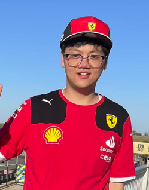

 &emsp; &emsp; &emsp;

 <i>Tifosi</i> at F1 USGP

Austin, TX (2023)
 

# **Wei Wang**<b>（汪巍）</b>

<i><b>2020.9 - present:</b></i>

[Department of Physics & Astronomy](https://physics-astronomy.jhu.edu/), Bloomberg 357

Johns Hopkins University, Baltimore, MD 21218

**Ph.D. candidate**

**Advisor**: [Brian A. Camley](https://bcamley.github.io)

<!-- * **Hometown**: &ensp;Huangshan City, Anhui Province, 245400, P. R. China. -->

* **Phone**: &ensp; +1 (667) 900-3371 / +86 131 5559 0878

* **E-mail**: &ensp;[wei.wang@jhu.edu](mailto:wei.wang@jhu.edu) (work) / [ww000721@gmail.com](mailto:ww000721@gmail.com)

&ensp;

## **EDUCATION**

&ensp;**Johns Hopkins University, Baltimore**

- Ph.D. candidate, Physics &ensp; · · · · · · · · · · · · · · · · · · · · · · · · · · · · · &ensp;**2023-present**

    * Advisor: Brian A. Camley\
    &ensp;

- M.A., Physics &ensp; · · · · · · · · · · · · · · · · · · · · · · · · · · · · · · · · · · · · · · · · · · &ensp;**2020-2023**

&ensp;**Tongji University, Shanghai**

- B.S., Physics <!--(*summa cum laude*)--> &ensp;· · · · · · · · · · · · · · · · · · · · · · · · · · · · · · · · · · · · · · · · · · · &ensp;**2016-2020**

&emsp;

&emsp;

&emsp;

&ensp;

&ensp;

[<b><u>Back to the Home page</u></b>]({{ site.url }}{{ site.baseurl }})

&ensp;